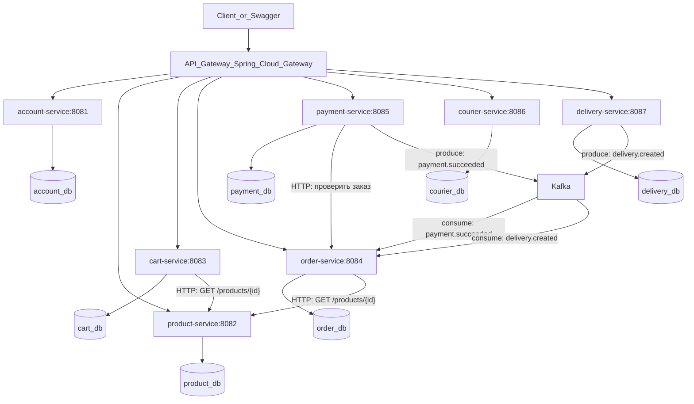
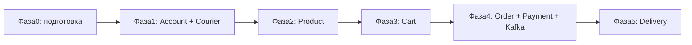
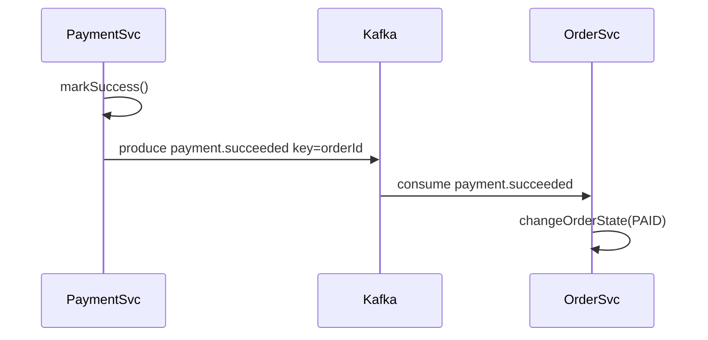
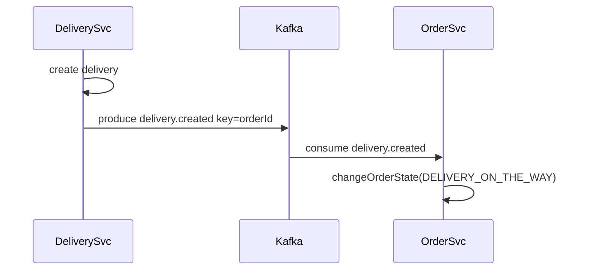

# План миграции my_store на микросервисы

Пошаговый учебный план миграции монолита на микросервисы с Docker Compose. Фокус — понять границы доменов, разделение БД и замену прямых вызовов на HTTP/события через Kafka.

## Чеклист

- [ ] **Фаза 0:** вынести common-lib, создать интерфейсы AccountClient/ProductClient/OrderClient, убрать cross-domain repository-зависимости
- [ ] **Фаза 0:** денормализовать order_items/payments/deliveries, добавить Flyway миграции
- [ ] **Фаза 1:** вынести account-service и courier-service, настроить API Gateway и docker-compose
- [ ] **Фаза 2:** вынести product-service, заменить проверки cart/order на HTTP-вызовы
- [ ] **Фаза 3:** вынести cart-service с HTTP-зависимостями на account и product
- [ ] **Фаза 4:** вынести order-service и payment-service, внедрить Kafka (топик payment.succeeded) для асинхронной смены статуса заказа
- [ ] **Фаза 5:** вынести delivery-service, подключить к order и courier через HTTP, опционально событие delivery.created в Kafka
- [x] **Фаза 6 (частично):** монолит удалён, `docker-compose-databases.yml` (7 БД), Kafka, локальные скрипты запуска
- [ ] **Фаза 6 (осталось):** API Gateway, единый docker-compose с приложениями, contract/integration тесты, Flyway

---

## Что у вас сейчас

Проект — **монолит** Spring Boot 4.1 с 7 доменными пакетами в одном Maven-модуле и **одной PostgreSQL**:

| Домен | Пакет | Таблицы |
|-------|-------|---------|
| Account | `account/` | `accounts` |
| Product | `product/` | `products` |
| Cart | `cart/` | `carts`, `cart_items` |
| Order | `order/` | `orders`, `order_items` |
| Payment | `payment/` | `payments` |
| Courier | `courier/` | `couriers` |
| Delivery | `delivery/` | `deliveries` |

**Главная проблема для микросервисов** — домены связаны не только через API, но и через **прямые Java-вызовы** и **общую БД с FK**.

Критичные связи в коде:

```java
// PaymentServiceImpl.java
private final OrderRepository orderRepository;
private final OrderService orderService;
```

```java
// OrderServiceImpl.java
private final AccountRepository accountRepository;
private final ProductService productService;
```

```java
// ProductServiceImpl.java
private final CartItemRepository cartItemRepository;
private final OrderItemRepository orderItemRepository;
```

При успешной оплате Payment **синхронно** меняет статус заказа:

```java
// PaymentServiceImpl.markSuccess()
orderService.changeOrderState(entity.getOrder().getId(), STATE_ORDER.PAID);
```

---

## Целевая архитектура (учебная, Docker Compose)



**Принципы для обучения:**
- **Database per service** — у каждого сервиса своя БД, FK между сервисами убираем
- **Синхронные HTTP-вызовы** — для простых проверок (существует ли аккаунт/товар)
- **Асинхронные события через Kafka** — для побочных эффектов (оплата → смена статуса заказа)
- **API Gateway** — единая точка входа, маршрутизация `/rest/accounts/**` → account-service
- **Без Kubernetes** на старте — всё в `docker-compose.yml`

---

## Kafka: топики и контракты событий

Для учебного проекта достаточно JSON-сообщений в `common-lib`:

| Топик | Producer | Consumer | Key | Назначение |
|-------|----------|----------|-----|------------|
| `payment.succeeded` | payment-service | order-service | `orderId` | Заказ переходит в `PAID` |
| `delivery.created` | delivery-service | order-service | `orderId` | Опционально: заказ → `DELIVERY_ON_THE_WAY` |

Пример payload `PaymentSucceededEvent`:
```json
{
  "eventId": "uuid",
  "paymentId": 42,
  "orderId": 100,
  "occurredAt": "2026-07-15T12:00:00Z"
}
```

**Почему Kafka, а не очередь:**
- События — **лог**: можно перечитать историю (replay) при отладке
- **Партиционирование по `orderId`** — все события одного заказа идут в одну партицию, сохраняется порядок
- **Consumer groups** — при масштабировании order-service Kafka сам распределяет партиции

---

## Стратегия: Strangler Fig (постепенное «удушение» монолита)

Не переписывать всё сразу. Монолит остаётся рабочим, домены выносятся по одному.



---

## Фаза 0. Подготовка монолита (1–2 недели)

Цель: сделать код готовым к разделению, не меняя поведение.

### 0.1. Maven multi-module структура

Преобразовать репозиторий:

```
my_store/
├── pom.xml                    # parent POM
├── common-lib/                # общие DTO, exceptions, events
├── account-service/
├── product-service/
├── cart-service/
├── order-service/
├── payment-service/
├── courier-service/
├── delivery-service/
├── api-gateway/
└── monolith/                  # временно — старый код, пока не вынесли всё
```

На первом шаге можно оставить **один рабочий монолит** и вынести только `common-lib` с:
- `GlobalErrorHandler` и исключениями (`src/main/java/com/example/my_store/utils/exception/`)
- `DateAudit` (`src/main/java/com/example/my_store/utils/`)
- контрактами событий: `PaymentSucceededEvent`, `DeliveryCreatedEvent`
- константами топиков: `KafkaTopics.PAYMENT_SUCCEEDED`, `KafkaTopics.DELIVERY_CREATED`

### 0.2. Убрать cross-domain доступ к чужим репозиториям

Заменить прямые зависимости на **интерфейсы** (порты), чтобы потом подменить реализацию:

| Сейчас | Интерфейс | Реализация сейчас | Реализация после миграции |
|--------|-----------|-------------------|---------------------------|
| `ProductServiceImpl` → `CartItemRepository` | `ProductUsageChecker` | локальный SQL | HTTP к cart/order |
| `PaymentServiceImpl` → `OrderRepository` | `OrderClient` | локальный repo | HTTP к order-service |
| `CartServiceImpl` → `AccountRepository` | `AccountClient` | локальный repo | HTTP к account-service |

Это ключевой паттерн **Hexagonal Architecture / Ports & Adapters** — учебная основа микросервисов.

### 0.3. Денормализация данных для разделения БД

В `order_items` сейчас хранится FK на `products`. После разделения:
- хранить `product_id` как **внешний идентификатор без FK**
- добавить snapshot: `product_name`, `product_price` (цена уже есть — хорошо)
- в `payments` и `deliveries` — только `order_id` без JPA-связи `@ManyToOne` на чужую сущность

### 0.4. Flyway вместо `ddl-auto=update`

Добавить миграции схемы — без этого нельзя надёжно разделить БД. Каждый сервис получит свой набор SQL-скриптов.

---

## Фаза 1. Первые автономные сервисы: Account и Courier

**Почему первыми:** минимум зависимостей от других доменов.

### Account Service
- Скопировать пакет `account/` + `utils/` в отдельный Spring Boot проект
- Своя БД `account_db`, таблица `accounts`
- Порт `8081`, те же эндпоинты `/rest/accounts/**`
- Dockerfile + healthcheck через Actuator

### Courier Service
- Аналогично: пакет `courier/`, БД `courier_db`, порт `8086`
- Заменить `CourierServiceImpl` → `DeliveryRepository` на HTTP-запрос к delivery-service (пока delivery в монолите — временный адаптер)

### Инфраструктура
Расширить `docker-compose-pg.yml`:

```yaml
services:
  account-db: ...
  courier-db: ...
  account-service: ...
  courier-service: ...
  api-gateway: ...
```

### API Gateway
Spring Cloud Gateway маршруты:
- `/rest/accounts/**` → `http://account-service:8081`
- `/rest/couriers/**` → `http://courier-service:8086`
- остальное → монолит `http://monolith:8080`

**Проверка:** CRUD аккаунтов и курьеров работает через gateway, монолит для остального не сломан.

---

## Фаза 2. Product Service

### Что вынести
- Пакет `product/`, БД `product_db`, порт `8082`

### Главная сложность
`ProductServiceImpl.setInactiveProduct()` проверяет наличие товара в корзине и активных заказах через **чужие репозитории**. Решения:

**Вариант A (проще для обучения):** синхронные HTTP-вызовы
- `GET /internal/carts/has-product/{productId}` в cart-service
- `GET /internal/orders/has-active-product/{productId}` в order-service (пока в монолите)

**Вариант B (правильнее):** событие `ProductDeactivationRequested` + ответ, но сложнее для старта

Рекомендация для обучения: **Вариант A**.

### Изменения в Order/Cart
При создании заказа/добавлении в корзину — вместо `productService.getRequiredActiveProduct()` вызывать:
```java
// OrderClient (HTTP)
ProductDto product = productClient.getActiveProduct(productId);
orderItem.setProductId(product.id());
orderItem.setPrice(product.price());
```

---

## Фаза 3. Cart Service

### Зависимости
- `AccountClient` — проверка `accountId` (HTTP к account-service)
- `ProductClient` — проверка активного товара (HTTP к product-service)

### БД
- `cart_db`: `carts`, `cart_items`
- `cart_items.product_id` — без FK, только Long

### Что изучить на этом этапе
- **Service-to-service HTTP** через `RestClient` или OpenFeign
- Обработка ошибок: 404 от product-service → 409 в cart-service
- Идемпотентность не нужна (учебный проект), но полезно понять концепцию

---

## Фаза 4. Order + Payment + Kafka (самый важный этап)

### Order Service
- БД `order_db`: `orders`, `order_items`
- Зависимости: `AccountClient`, `ProductClient`
- Эндпоинт `PATCH /rest/orders/{id}/change-status` — state machine из `OrderServiceImpl`
- Внутренний API: `GET /internal/orders/{id}` для payment-service
- **Kafka Consumer** на топик `payment.succeeded`

### Payment Service
- БД `payment_db`: `payments` (только `order_id`, без JPA-связи)
- При `create`: HTTP-запрос к order-service — проверить статус `ACCEPTED`
- При `markSuccess`: **больше не вызывать** `orderService.changeOrderState()` напрямую
- **Kafka Producer** — публикует `PaymentSucceededEvent` в топик `payment.succeeded`

### Паттерн: событие вместо прямого вызова



**Зачем событие, а не HTTP?** Payment не должен знать бизнес-логику смены статуса заказа. Это **слабая связанность** — ключевой принцип микросервисов.

### Kafka в Spring Boot

Зависимость: `spring-kafka`.

**Producer (payment-service):**
```java
kafkaTemplate.send(
    KafkaTopics.PAYMENT_SUCCEEDED,
    String.valueOf(event.orderId()),  // key — порядок событий по заказу
    event
);
```

**Consumer (order-service):**
```java
@KafkaListener(
    topics = KafkaTopics.PAYMENT_SUCCEEDED,
    groupId = "order-service"
)
void onPaymentSucceeded(PaymentSucceededEvent event) {
    orderService.changeOrderState(event.orderId(), STATE_ORDER.PAID);
}
```

**Что изучить на этом этапе:**
- **Topics, partitions, consumer groups** — базовые концепции Kafka
- **Outbox pattern** (опционально) — сохранить событие в БД payment, отдельный процесс отправляет в Kafka
- **Идемпотентность** — Order Service проверяет `eventId` или статус заказа (`ACCEPTED` → `PAID`), повторное сообщение не ломает систему
- **At-least-once delivery** — Kafka может доставить сообщение дважды, consumer должен быть идемпотентным
- **Распределённые транзакции** — нет единого `@Transactional` между payment и order; eventual consistency — норма

### Kafka в docker-compose

Для учебного проекта — один брокер в KRaft-режиме (без Zookeeper):

```yaml
kafka:
  image: apache/kafka:3.7.0
  ports:
    - "9092:9092"
  environment:
    KAFKA_NODE_ID: 1
    KAFKA_PROCESS_ROLES: broker,controller
    KAFKA_LISTENERS: PLAINTEXT://0.0.0.0:9092,CONTROLLER://0.0.0.0:9093
    KAFKA_ADVERTISED_LISTENERS: PLAINTEXT://kafka:9092
    KAFKA_CONTROLLER_LISTENER_NAMES: CONTROLLER
    KAFKA_CONTROLLER_QUORUM_VOTERS: 1@kafka:9093
    KAFKA_OFFSETS_TOPIC_REPLICATION_FACTOR: 1
    KAFKA_TRANSACTION_STATE_LOG_REPLICATION_FACTOR: 1
    KAFKA_TRANSACTION_STATE_LOG_MIN_ISR: 1
```

Конфигурация в сервисах:
```properties
spring.kafka.bootstrap-servers=kafka:9092
spring.kafka.consumer.group-id=${spring.application.name}
spring.kafka.consumer.auto-offset-reset=earliest
spring.kafka.consumer.key-deserializer=org.apache.kafka.common.serialization.StringDeserializer
spring.kafka.consumer.value-deserializer=org.springframework.kafka.support.serializer.JsonDeserializer
spring.kafka.producer.key-serializer=org.apache.kafka.common.serialization.StringSerializer
spring.kafka.producer.value-serializer=org.springframework.kafka.support.serializer.JsonSerializer
```

Опционально: **Kafka UI** (`provectuslabs/kafka-ui`) на порту `8088` — удобно смотреть топики и сообщения при обучении.

---

## Фаза 5. Delivery Service

### Зависимости
- `OrderClient` — проверка существования заказа и статуса
- `CourierClient` — проверка активного курьера

### БД
- `delivery_db`: `deliveries` (`order_id`, `courier_id` без FK)

### Связь с жизненным циклом заказа через Kafka

Сейчас создание delivery **не меняет** статус заказа автоматически. В микросервисах:

1. **Сначала (проще):** ручное управление через `PATCH /orders/{id}/change-status`
2. **Затем (учебное расширение):** delivery-service публикует `DeliveryCreatedEvent` в топик `delivery.created`, order-service переводит заказ в `DELIVERY_ON_THE_WAY`



---

## Фаза 6. Финализация

1. Удалить монолит-модуль из репозитория
2. Все маршруты в API Gateway
3. Единый `docker-compose.yml` поднимает 7 сервисов + 7 БД + Kafka (+ Kafka UI) + Gateway
4. Contract tests: проверить, что API-контракты не сломались (можно переиспользовать существующие `*ControllerTest`)
5. Integration test: `markSuccess` → сообщение в `payment.succeeded` → заказ становится `PAID` (Testcontainers Kafka)

---

## Структура docker-compose (итог)

| Сервис | Порт | БД / брокер |
|--------|------|-------------|
| api-gateway | 8080 | — |
| account-service | 8081 | account_db:5433 |
| product-service | 8082 | product_db:5434 |
| cart-service | 8083 | cart_db:5435 |
| order-service | 8084 | order_db:5436 |
| payment-service | 8085 | payment_db:5437 |
| courier-service | 8086 | courier_db:5438 |
| delivery-service | 8087 | delivery_db:5439 |
| kafka | 9092 | — |
| kafka-ui (опционально) | 8088 | — |

---

## Что НЕ делать на учебном этапе

- Kubernetes, service mesh (Istio), distributed tracing — позже
- Spring Security / JWT — можно добавить отдельным этапом
- CQRS, Event Sourcing — избыточно для этого проекта
- Schema Registry (Avro/Protobuf) — для учебного проекта достаточно JSON
- Отдельный discovery (Eureka/Consul) — в Docker Compose достаточно имён сервисов
- Kafka Connect, ksqlDB — не нужны на старте

---

## Порядок изучения концепций по ходу миграции

| Фаза | Концепция |
|------|-----------|
| 0 | Ports & Adapters, подготовка к разделению, контракты событий |
| 1 | Database per service, API Gateway, Docker multi-container |
| 2 | Sync HTTP между сервисами, отказ от FK |
| 3 | Service clients, обработка ошибок между сервисами |
| 4 | Kafka: topics, partitions, consumer groups, producer/consumer, eventual consistency, идемпотентность |
| 5 | Event-driven оркестрация бизнес-процесса (delivery.created) |
| 6 | Contract testing, integration tests с Testcontainers Kafka |

---

## Рекомендуемый первый шаг

Начать с **Фазы 0.2** — вынести интерфейсы `AccountClient`, `ProductClient`, `OrderClient` в монолите и заменить прямые вызовы чужих репозиториев. Это не ломает приложение, но сразу показывает, как микросервисы «думают» о зависимостях.

Затем **Фаза 1** — вынести `account-service` как первый реально работающий микросервис с Docker Compose и Gateway.

Kafka подключается на **Фазе 4** вместе с order-service и payment-service — это логичный момент, когда появляется первый реальный сценарий event-driven взаимодействия.
