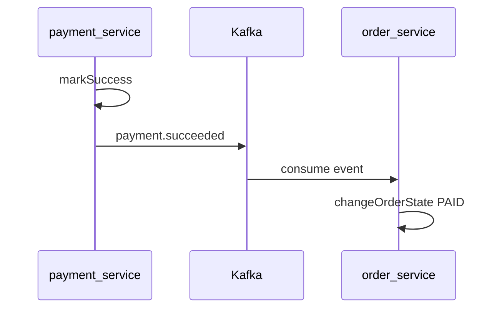

# order-service

## Назначение

Сервис **заказов**: создание с позициями, чтение, **state machine** статусов (`CREATED` → `ACCEPTED` → `PAID` → … → `RECEIVED_BY_USER` / `CANCELED`). При создании заказа проверяются account и product через HTTP.

- Порт: **8084**
- API: `/rest/orders`
- БД: `order_db` (PostgreSQL, порт **5436**)

## Роль в процессе

Центральный домен после корзины. Payment-service создаёт платёж для заказа в статусе `ACCEPTED`; после успешной оплаты заказ переводится в `PAID` асинхронно через Kafka.

```
account → products → cart → order → payment → courier → delivery
                            ↑         │
                            └─ Kafka ─┘ (payment.succeeded → PAID)
```

## Зависимости

| Тип | Ресурс |
|-----|--------|
| БД | PostgreSQL (`order_db`) |
| HTTP-клиенты | account-service (**8081**), products-service (**8082**) |
| Kafka | consumer топика `payment.succeeded` → `PaymentEventListener` |

### Kafka flow



## Структура

```
src/main/java/com/example/
├── Main.java
├── config/              # Kafka consumer, WebClient
├── controller/          # REST-эндпоинты, DTO заказа и смены статуса
├── service/
│   ├── OrderServiceImpl # CRUD, state machine статусов
│   └── PaymentEventListener  # Kafka → changeOrderState(PAID)
├── repository/
│   ├── order/
│   │   └── entity/      # OrderEntity
│   └── order_item/
│       └── entity/      # OrderItemEntity
└── utils/               # MapStruct-мапперы
```

## Запуск

Инструкция по окружению и запуску всего проекта: [README.md](../README.md), сценарий ручного тестирования: [scripts/local-dev.md](../scripts/local-dev.md).
