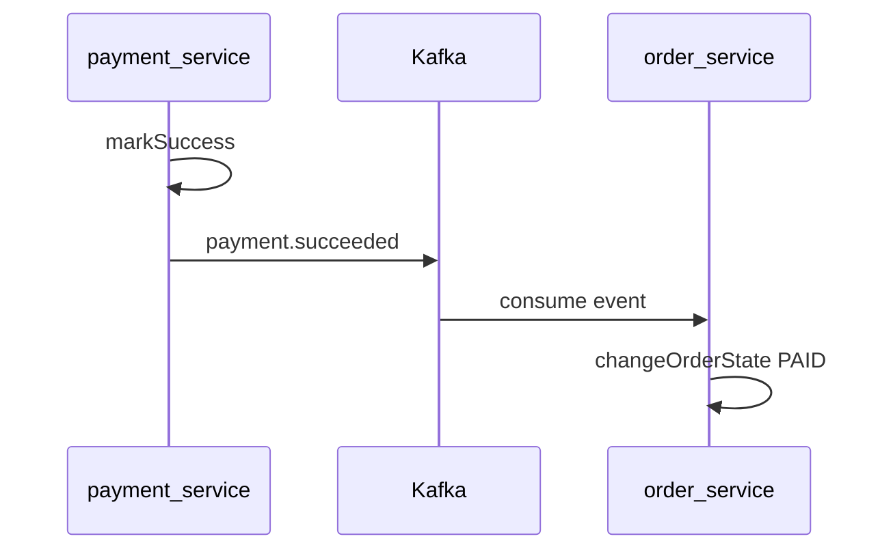

# payment-service

## Назначение

Сервис **платежей** по заказам: создание (заказ должен быть в статусе `ACCEPTED`), отметка успеха или неудачи. После успешной оплаты публикуется событие **`payment.succeeded`** в Kafka (после commit транзакции).

- Порт: **8085**
- API: `/rest/payments`
- БД: `payment_db` (PostgreSQL, порт **5437**)

## Роль в процессе

Следует за order-service. Создаёт платёж для принятого заказа; при `mark-success` уведомляет order-service через Kafka о переходе заказа в `PAID`.

```
account → products → cart → order → payment → courier → delivery
                                     ↑
                                  (здесь)
```

## Зависимости

| Тип | Ресурс |
|-----|--------|
| БД | PostgreSQL (`payment_db`) |
| HTTP-клиенты | order-service (**8084**) — проверка статуса заказа |
| Kafka | producer топика `payment.succeeded` (after-commit) |

### Kafka flow



## Структура

```
src/main/java/com/example/
├── Main.java
├── config/              # Kafka producer, WebClient
├── controller/          # REST-эндпоинты, DTO платежа
├── service/
│   ├── PaymentServiceImpl       # CRUD, mark-success / mark-failure
│   ├── PaymentEventPublisher    # отправка payment.succeeded
│   └── PaymentKafkaEventListener # after-commit → publish
├── repository/
│   └── entity/          # PaymentEntity, STATE_PAYMENT
└── utils/               # MapStruct-маппер
```

## Запуск

Инструкция по окружению и запуску всего проекта: [README.md](../README.md), сценарий ручного тестирования: [scripts/local-dev.md](../scripts/local-dev.md).
